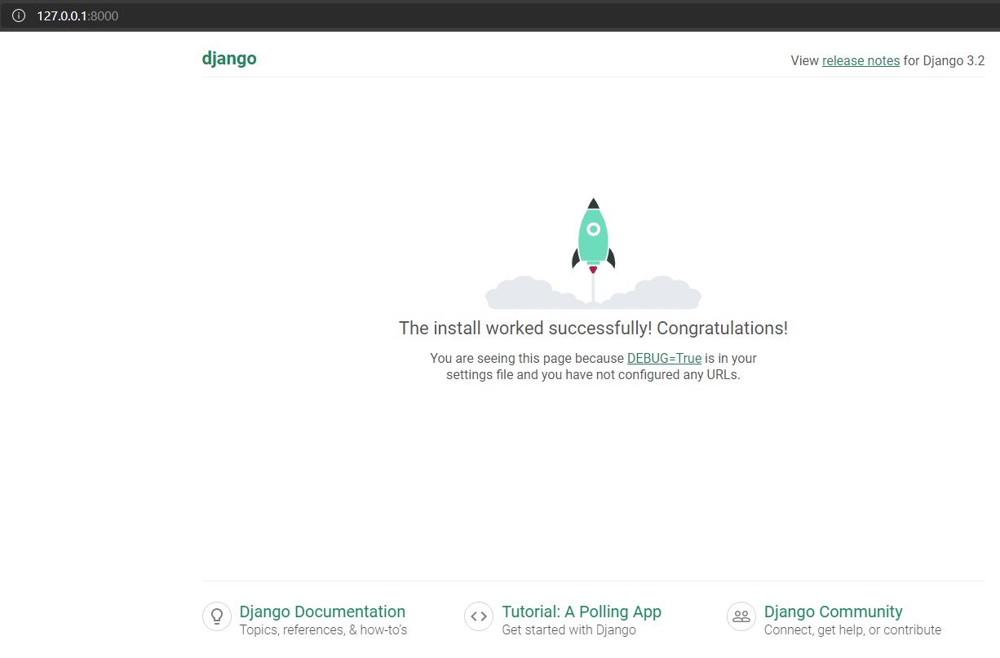

# django-report-app

## Installation
In order to install all the necessary pre-requisites you can do the following steps (I used Visual Studio Code but it can be easily developed in VIM):
* Install [Python](https://www.python.org/).
  * It is recommended to add Python to PATH.
  * Create a virtual environment or *venv* in your IDE project, in Windows you can run:
    ```
    mkdir myproject
    cd myproject
    py -3 -m venv venv
    ```
  * Activate the *venv* just created.
    ```
    venv\Scripts\activate
    ```
* Install [Django](https://www.djangoproject.com/download/).
  * In your just created *venv*, install Django with *pip* running: `pip install django`.
* (Optional) if you're asked to update pip inside your virtual environment please read the answers of this [thread](https://stackoverflow.com/questions/15221473/how-do-i-update-upgrade-pip-itself-from-inside-my-virtual-environment) first, as I encountered a couple of issues there and my pip was removed in the process.
* Configure you Django project (for a more thorough step-by-step you can check the [documentation](https://docs.djangoproject.com/en/3.2/intro/tutorial01/)).
  * To start a new Django project run the following command: `django-admin startproject report_app`.
  * Rename `reports_app\report_app` to `reports_app\src`.
  * In the project `report_app` folder, run `py manage.py migrate` to create the database and tables, if an exception is thrown make sure the code inside `manage.py` and `src\settings.py` are pointing to `src` folder.
* To open the project database you can use [sqlite3 browser app](https://sqlitebrowser.org/dl/) or install [SQLite](https://marketplace.visualstudio.com/items?itemName=alexcvzz.vscode-sqlite) VS Code extension.
* Create super user running: `py manage.py createsuperuser`.
* Let's create our first apps:
    ```
    py manage.py startapp sales
    py manage.py startapp reports
    py manage.py startapp profiles
    py manage.py startapp products
    py manage.py startapp products
    ```
* Run the server using `py manage.py runserver`. Open a browser and navigate to `http://127.0.0.1:8000/` You should see the following confirmation page:



* Also, we can navigate to `http://127.0.0.1:8000/admin/` and test your created admin user.

## Features
* Securing your Django project secret key after installation ([source](https://dev.to/vladyslavnua/how-to-protect-your-django-secret-and-oauth-keys-53fl)):
  * In your *venv* install Python dotenv: `pip install python-dotenv`.
  * In your `settings.py` file paste the following two lines:
    ```
    from dotenv import load_dotenv
    load_dotenv()
    ```
  * Create a file titled `.env` in the root of your project, which will serve as your environment variable secret storage for your project, in the file declare your keys such as:
    ```
    # .env
    SECRET_KEY=ek0@9u(zemu^+%*-z3!&y9mu_7u+edg9%)c%423mdoec-mi*
    ```
  * In your `settings.py` retrieve the key(s) as follows:
    ```
    # settings.py
    SECRET_KEY = str(os.getenv('SECRET_KEY'))
    ```